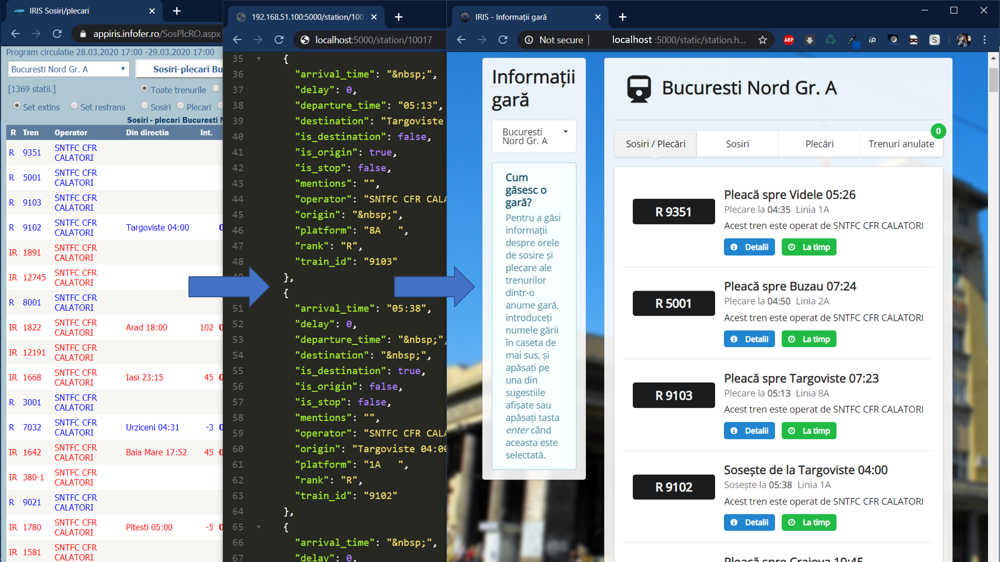

# CFR IRIS Scraper: Romanian Railways API



CFR S.A., the Romanian national railway infrastructure administration company offers an online live information service
(based on ASPX forms with postback viewstate sending and event validation) for getting **near real-time data** about
departures, arrivals and platforms where trains arrive in stations and trip delays and updates. At the time, this whole
 system lacks and API or even a decent, easy to use and easy to find interface for end users. 

This Flask based API extracts data from the CFR webapp as requested in the URL API Endpoint and outputs reusable JSON data.
The program scrapes all its information from ASP.Net's __VIEWSTATE variable.

## Installation & Requirments
- You need Python 3.6+ and Pipenv installed on your system.
- Clone the repository and install the module dependencies:
```sh
$ cd cfr-iris-scraper
$ pipenv install
```
- Run the API server as specified in the [Flask Documentation](https://flask.palletsprojects.com/en/1.1.x/cli/).

## Usage
### Station information
Now you can point your browser to http://localhost:5000/station/ID to see the magic. ID is the unique station-unit code;
a list is provided by the http://localhost:5000/get-stations/ endpoint.

For example, to get a JSON object with the current departure/arrival board & delay information for the Bucharest North
railway station (the main & biggest one in our country), you would point your browser or the URL variable for whatever
app you are consuming the data with to: http://localhost:5000/station/10017.

### Train information
In the same way you can get the current trains in a certain railway station, you can get the current information for a
certain train. CFR provides information such as delays, the last station the train has passed (with a 7-minute delay),
the next station and other useful information.

Just point your browser to http://localhost:5000/train/ID, where ID is the train's unique number. You can get these IDs
from the station information feed. For example, you can retrieve the information for train IR 1651 from Bucharest North
to Suceava North (valid as of April 2017) by accessing http://localhost:5000/train/1651.

## Ideas
While the official apps themselves work but may not look so great, romanian developers did their best to create some
really cool open source projects and online services related to transportation and infrastructure.
See [this live map](http://cfr.webgis.ro/), [this proprietary to GTFS converter](https://github.com/vasile/data.gov.ro-gtfs-exporter),
[this trip planner](https://www.acceleratul.ro), etc.

Using this API and other public resources, you may create your own style of station departure board, delay-notification
service, cool looking mobile app, while learning how to program and work with structured data?

## License, disclaimer and known limitations
This is a completely open source project, built on open source modules and libraries and licensed under
[Do What the Fuck You Want to Public License Version 2](http://www.wtfpl.net/).

Also, you are completely responsible for what you do with it - keep in mind that CFR S.A. and InfoFer
(the state-railway owned IT firm which builds their software) are not particularly transparent or third party developer
friendly. If you do mass-scraping or develop some publicly accessible service that generates loads of traffic from the
same server to them or clones their data to a database for various reasons, you may run into some trouble,
[as this fellow enthusiast did while making a web trip-planner using CFR Calatori's timetable from their website](http://legi-internet.ro/blogs/index.php/cfr-crede-ca-are-monopol-pe-mersul-trenurilor-pe-internet).

But for tinkering, playing around and working with real-time data that clearly can't confuse anyone if the error is not
from CFR themselves, you should be fine and on the right side of the law, at least from my experience. Maybe they'll
offer their own API with proper rules and licensing at some point.

#### Known limitations:
- Requests are not authenticated and no rate limiting is implemented, so it's in no way ready to be exposed on the web.
- This is not particularly fast, because the CFR Webpage isn't either. You'll probably want background requests and
caching. ~~After the initial request is made, it'll wait 8 seconds before parsing the data. If data hasn't been displayed
on the webpage, it will wait an additional 20 seconds. After this, the API will output a blank object - this may mean
that the scraped web service is down, it is really slow to respond or there are really no current trips stopping at that
particular station (at night or at a small stop, for example).~~ Fixed: if the API is down you'll get a 5xx error status. 
- This is scraping and parsing, so any structural update to the CFR webpage, while highly unlikely in the near future
may break this.
- ~~The train information feed does not provide the details regarding the train's delays and other useful information that
Infofer offers with their service. This will be updated in the future.~~ Fixed: all public IRIS information is outputted on this API.

Public information web-service provided by CFR S.A. through Informatica Feroviara:
http://appiris.infofer.ro/SosPlcRO.aspx, http://appiris.infofer.ro/MyTrainRO.aspx,
http://appiris.infofer.ro/MersTrenRo.aspx. This is information from infrastructure administration and not a specific
passenger carrier. Official passenger timetables are found here: http://mersultrenurilorcfr.ro, http://infofer.ro/
and static data source with timetables updated at the end of each year:
http://data.gov.ro/organization/sc-informatica-feroviara-sa
